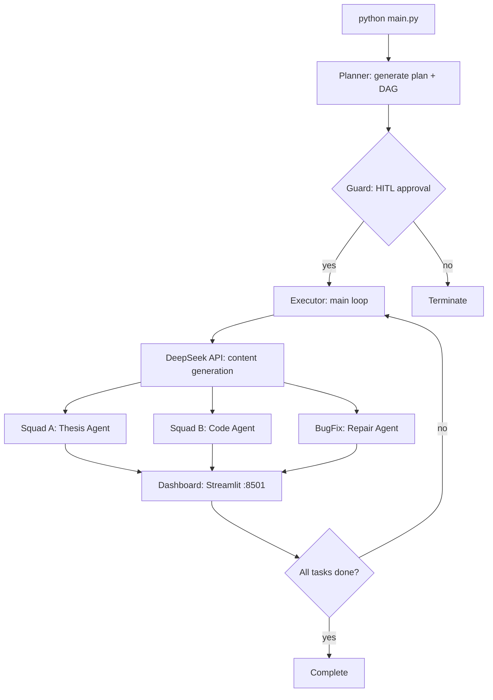

# AgentOS Lite

**Python + DeepSeek API DAG Multi-Agent Engine**

Start-to-finish graduation project automation: Plan -> HITL Approval -> DAG Execution -> Live Dashboard

[](https://www.python.org/)
[](https://www.deepseek.com/)
[](https://streamlit.io/)
[](LICENSE)

---

## Table of Contents

- [Overview](#overview)
- [Architecture](#architecture)
- [Quick Start](#quick-start)
- [Installation](#installation)
- [DeepSeek API Setup (Required)](#deepseek-api-setup-required)
- [Usage Walkthrough](#usage-walkthrough)
- [Project Structure](#project-structure)
- [Core Modules](#core-modules)
- [Agent System](#agent-system)
- [Dashboard](#dashboard)
- [Runtime State Files](#runtime-state-files)
- [Customization](#customization)
- [Version History](#version-history)
- [FAQ](#faq)
- [Contributing](#contributing)
- [License](#license)

---

## Overview

**AgentOS Lite** is a lightweight Python agent collaboration engine. It manages multi-agent task dependencies via DAG (Directed Acyclic Graph), enforces execution quality through Plan-first + HITL (Human-in-the-Loop) approval, and provides real-time progress monitoring through a Streamlit Dashboard.

**Primary use case**: automating the complete graduation project workflow -- thesis writing, code development, and bug fixing, all driven by the DeepSeek AI API.

### Core Capabilities

| Capability | Description |
|---|---|
| Multi-Agent | Squad A (Thesis) + Squad B (Code) + BugFix Agent |
| DAG Scheduler | Topological sort + dependency-aware execution order |
| HITL Approval | Human reviews plan before execution; rejected plans are blocked |
| DeepSeek API | Direct connection via OpenAI-compatible protocol |
| Streamlit Dashboard | Real-time task monitoring at localhost:8501 |
| One-command Start | `python main.py` runs everything |

### Design Philosophy

> "Protocol documents are perfect for reading. Executable code is perfect for running."

AgentOS Lite v4.0 is a ground-up rewrite of its predecessor `grad-design-squad` v3.0:

| Dimension | v3.0 (old) | v4.0 (new) |
|---|---|---|
| Agent count | 48 role cards | 3 Squad Agents |
| Orchestration | TL->Squad Lead->Sub-Agent 3-tier | Plan->HITL->Executor main loop |
| Gates | 17 checkpoints | 1 HITL approval |
| Codebase | ~32KB Markdown protocols | ~14KB Python (executable) |
| LLM integration | None | DeepSeek v4-pro |
| Startup | Manual orchestration | `python main.py` |

---

## Architecture



### Data Flow

```
runtime/plan.json  -->  Executor  -->  runtime/queue.json
                           |
                      DeepSeek API
                           |
              +------------+------------+
              |            |            |
         paper_T*.txt  code_T*.py  fix_T*.py
              |            |            |
              +------------+------------+
                           |
                   runtime/logs.json
                           |
                       Dashboard
```

---

## Quick Start

```bash
# 1. Clone
git clone https://github.com/your-username/AgentOS-Lite.git
cd AgentOS-Lite

# 2. Install dependencies
pip install -r requirements.txt

# 3. Configure API Key (REQUIRED - see section below)
cp .env.example .env
# Edit .env and paste your DeepSeek API Key

# 4. Run
python main.py
```

After launching:
- **Terminal** shows the HITL approval prompt (type `yes` to proceed)
- **Browser** auto-opens `http://localhost:8501` with the live Dashboard
- **Executor** starts running tasks in DAG order

---

## Installation

### Requirements

- Python 3.10+
- pip
- Internet access (for DeepSeek API)

### Dependencies

```
openai>=1.0.0      # DeepSeek API (OpenAI-compatible protocol)
streamlit>=1.28.0  # Real-time monitoring Dashboard
```

### Steps

```bash
# Create virtual environment (recommended)
python -m venv venv
venv\Scripts\activate   # Windows
# source venv/bin/activate  # macOS / Linux

# Install
pip install -r requirements.txt
```

---

## DeepSeek API Setup (Required)

> **This project does NOT include any API Key.** You must register for a DeepSeek account and obtain your own key. All API calls read from a `.env` file and will never be committed to Git.

### If using with Codex

AgentOS Lite is registered as a mandatory preload skill in Codex. When the skill loads, it **automatically checks** whether the API Key is configured. If not, Codex will prompt you directly:

> "AgentOS Lite requires a DeepSeek API Key to run. Steps:
> 1. Visit https://platform.deepseek.com/api_keys to register and get your key
> 2. Run `cp .env.example .env` in the project root
> 3. Edit `.env` and replace the placeholder with your real key
> 4. Re-trigger the graduation project workflow"

### If using via command line

```bash
# 1. Register on DeepSeek Platform and obtain an API Key
#    https://platform.deepseek.com/api_keys

# 2. Create the .env file from the template
cp .env.example .env

# 3. Edit .env with your key
#    DEEPSEEK_API_KEY=sk-your-real-key-here

# 4. Launch
python main.py
```

### .env File Format

```env
DEEPSEEK_MODEL=deepseek-chat
DEEPSEEK_BASE_URL=https://api.deepseek.com
DEEPSEEK_API_KEY=sk-your-real-key-here
```

| Variable | Description | Default |
|---|---|---|
| `DEEPSEEK_MODEL` | Model name | `deepseek-chat` |
| `DEEPSEEK_BASE_URL` | API endpoint | `https://api.deepseek.com` |
| `DEEPSEEK_API_KEY` | **Required** -- your API Key | (none) |

### Available Models

| Model | Description | Recommended For |
|---|---|---|
| `deepseek-chat` | General-purpose chat model | Thesis writing, code generation |
| `deepseek-reasoner` | Deep reasoning model | Complex logic, bug fixing |

---

## Usage Walkthrough

### Step 1: Launch

```bash
python main.py
```

```
[BOOT] Agent OS Lite starting...
       DeepSeek Model: deepseek-chat
       Endpoint: https://api.deepseek.com (direct)
[PLAN] Plan generated
```

### Step 2: HITL Approval

```
=== PLAN REVIEW ===
Project: Graduation Project
Thesis chapters: ['Introduction', 'Related Work', 'System Design', 'Implementation', 'Experiments', 'Conclusion']
Code modules: ['core', 'agents', 'runtime']
DAG: {'T1': [], 'T2': ['T1'], 'T3': ['T2'], 'T4': ['T3']}
===================
Approve plan? (yes/no): yes
```

Type `yes` to proceed, `no` to abort.

### Step 3: Automatic Execution

```
[GUARD] Plan approved. Executing...
[EXECUTOR] Agent OS core loop running...
[EXECUTOR] Running T1 (paper)...
[Squad A] Thesis Agent: generated content for T1 (1847 chars)
[EXECUTOR] Running T2 (code)...
[Squad B] Code Agent: generated code for T2 (156 lines)
[EXECUTOR] Running T3 (code)...
[Squad B] Code Agent: generated code for T3 (203 lines)
[EXECUTOR] Running T4 (paper)...
[Squad A] Thesis Agent: generated content for T4 (2103 chars)
[EXECUTOR] All tasks complete. Idling...
```

### Step 4: Dashboard

Open `http://localhost:8501` in your browser:

- **PLAN** panel: thesis structure + code module list
- **DAG** panel: task dependency graph
- **QUEUE** panel: per-task real-time status (PENDING / RUNNING / DONE)
- **LOGS** panel: latest 20 execution log entries

### Step 5: View Output

```bash
# Generated thesis content
cat runtime/paper_T1.txt

# Generated code
cat runtime/code_T2.py

# Execution logs
cat runtime/logs.json
```

---

## Project Structure

```
AgentOS_Lite/
├── main.py                    # Entry point
├── requirements.txt           # Python dependencies
├── .env.example               # API Key template (commit to Git)
├── .gitignore                 # Excludes .env and runtime/ state
├── README.md                  # This file
│
├── bootstrap/                 # Boot layer
│   ├── __init__.py
│   ├── launcher.py            # Startup + DeepSeek API config (.env loader)
│   └── web_open.py            # Auto-open browser
│
├── core/                      # Engine layer
│   ├── __init__.py
│   ├── planner.py             # Generate project plan + DAG
│   ├── guard.py               # HITL human approval gate
│   ├── executor.py            # Main loop + DeepSeek API calls
│   └── scheduler.py           # DAG topological sort scheduler
│
├── agents/                    # Agent layer
│   ├── __init__.py
│   ├── squad_a.py             # Thesis generation agent
│   ├── squad_b.py             # Code generation agent
│   └── bugfix.py              # Bug fix agent
│
├── dashboard/                 # Visualization layer
│   └── app.py                 # Streamlit real-time monitoring
│
└── runtime/                   # Runtime state (gitignored)
    ├── plan.json              # Current project plan
    ├── dag.json               # Task dependency graph
    ├── queue.json             # Task queue + status
    └── logs.json              # Execution logs
```

---

## Core Modules

### 1. Planner (`core/planner.py`)

Defines the project task structure and DAG dependencies.

```python
def generate_plan(topic):
    return {
        "project": topic,
        "paper": {"chapters": ["Introduction", "Related Work", "..."]},
        "code": {"modules": ["core", "agents", "runtime"]},
        "dag": {
            "T1": [],        # No dependencies; runs first
            "T2": ["T1"],    # Depends on T1
            "T3": ["T2"],    # Depends on T2
            "T4": ["T3"]     # Depends on T3
        }
    }
```

### 2. Guard (`core/guard.py`)

Human approval gate. Displays the plan summary in the terminal and waits for `yes`/`no`. `PlanGuard.validate()` checks the `locked` flag before execution.

### 3. Executor (`core/executor.py`)

The heart of AgentOS. Main loop:

```
while True:
    for each PENDING + approved task in queue:
        task.status = RUNNING
        call DeepSeek API
        task.status = DONE
    sleep(2)
```

Task routing:

| task["type"] | API call | Output file | Agent |
|---|---|---|---|
| `"paper"` | `call_deepseek(prompt, max_tokens=2000)` | `paper_{id}.txt` | squad_a |
| `"code"` | `call_deepseek_code(prompt)` | `code_{id}.py` | squad_b |
| `"bug"` | `call_deepseek_code(fix_prompt)` | `fix_{id}.py` | bugfix |

### 4. Scheduler (`core/scheduler.py`)

Two core functions:

- `topological_sort(dag)`: Kahn''s algorithm returning a valid DAG execution order
- `get_ready_tasks(queue, dag)`: returns tasks whose dependencies are satisfied and status is PENDING

---

## Agent System

### Squad A -- Thesis Agent
- Generates thesis chapter content
- Output: `runtime/paper_{task_id}.txt`

### Squad B -- Code Agent
- Generates system code
- Output: `runtime/code_{task_id}.py`

### BugFix Squad -- Repair Agent
- Handles bug fix requests
- Output: `runtime/fix_{task_id}.py`

### Adding a New Agent

Each agent follows a uniform contract. To add a new one:

```python
# agents/squad_c.py
def run(task, content):
    task_id = task["id"]
    # Your logic here
    return {"task_id": task_id, "squad": "C", "result": "..."}

# In executor.py, add routing:
elif task["type"] == "my_type":
    from agents import squad_c
    squad_c.run(task, content)
```

---

## Dashboard

Built with **Streamlit** -- pure Python, zero frontend code.

```
http://localhost:8501
```

### Panel Layout

```
+----------------------------------------------------------+
|  AgentOS Lite -- DeepSeek Dashboard                       |
|  Model: deepseek-chat | Endpoint: api.deepseek.com        |
+--------------------+--------------------+----------------+
|  PLAN              |  DAG               |  QUEUE          |
|  Thesis chapters   |  T1 -> T2 -> T3    |  T1: DONE       |
|  Code modules      |       -> T4        |  T2: RUNNING    |
|                    |                    |  T3: PENDING    |
|                    |                    |  T4: PENDING    |
+--------------------+--------------------+----------------+
|  LOGS (latest 20 entries)                                |
|  [T1] DONE  [T2] RUNNING  [T3] PENDING  ...             |
+----------------------------------------------------------+
```

### Implementation Notes

- `st.rerun()` auto-refreshes every 2 seconds
- Reads `runtime/*.json` directly for live state
- Three-column layout via `st.columns(3)`
- Task status visualized with emoji: PENDING / RUNNING / DONE / FAILED

---

## Runtime State Files

The `runtime/` directory holds JSON files that serve as the state bus for AgentOS:

### plan.json

```json
{
  "project": "Graduation Project",
  "paper": {"chapters": ["Introduction", "..."]},
  "code": {"modules": ["core", "..."]},
  "dag": {"T1": [], "T2": ["T1"], "T3": ["T2"], "T4": ["T3"]}
}
```

### queue.json

```json
[
  {"id": "T1", "type": "paper", "status": "DONE", "prompt": "...", "approved": true},
  {"id": "T2", "type": "code", "status": "RUNNING", "prompt": "...", "approved": true}
]
```

### logs.json

```json
[
  {"task": "T1", "status": "DONE", "type": "paper"},
  {"task": "T2", "status": "FAILED", "error": "Connection timeout"}
]
```

> `runtime/` is excluded by `.gitignore` and will not be committed.

---

## Customization

### Change Project Structure

Edit `generate_plan()` in `core/planner.py`:

```python
def generate_plan(topic):
    return {
        "project": topic,
        "paper": {"chapters": ["Chapter 1", "Chapter 2", ...]},
        "code": {"modules": ["module1", ...]},
        "dag": {"T1": [], "T2": ["T1"], ...}
    }
```

### Add a New Task Type

1. In `core/executor.py` `run_task()`:
```python
elif task["type"] == "my_type":
    result = call_deepseek(ds_client, prompt, max_tokens=4000)
    save(f"{RUNTIME_PATH}/my_{task_id}.json", result)
```

2. In `bootstrap/launcher.py` `init_runtime()`:
```python
queue.append({
    "id": "T5", "type": "my_type",
    "status": "PENDING", "prompt": "...", "approved": False
})
```

### Switch LLM Provider

Any OpenAI-compatible API works -- just change `bootstrap/launcher.py` or your `.env`:

```env
# Claude (requires compatible gateway)
DEEPSEEK_BASE_URL=https://api.anthropic.com/v1

# Local model (Ollama)
DEEPSEEK_BASE_URL=http://localhost:11434/v1
DEEPSEEK_MODEL=llama3

# Other Chinese models
DEEPSEEK_BASE_URL=https://api.moonshot.cn/v1
DEEPSEEK_MODEL=moonshot-v1-8k
```

---

## Version History

| Version | Date | Description |
|---|---|---|
| v3.0 | 2026-06-08 | grad-design-squad: 48-agent 3-tier protocol architecture |
| v4.0 | 2026-06-11 | AgentOS Lite: DAG + DeepSeek API + Streamlit, executable Python |

---

## FAQ

**Q: How do I change the default thesis chapters?**
Edit the `chapters` list in `generate_plan()` inside `core/planner.py`.

**Q: Where is runtime state stored?**
In the `runtime/` directory as JSON files. All agents communicate by reading and writing these shared files.

**Q: How do I reset all tasks?**
Delete `runtime/queue.json` and `runtime/logs.json`, then run `python main.py` again.

**Q: What happens when a task fails?**
The Executor catches the exception, marks the task as FAILED, logs the error to `logs.json`, and continues to the next task.

**Q: Can this run without internet?**
Yes. Point `DEEPSEEK_BASE_URL` to a local model (e.g., Ollama at `http://localhost:11434/v1`).

**Q: How do I handle large projects (>20 tasks)?**
Add more DAG nodes in `core/planner.py` and register corresponding tasks in `init_runtime()`.

**Q: Why "AgentOS Lite"?**
"AgentOS" = Agent Operating System. "Lite" = lightweight. Compared to its v3.0 predecessor (48 role cards, read-only protocols), v4.0 is an actually executable lightweight engine.

---

## Contributing

Issues and Pull Requests are welcome.

### Dev Setup

```bash
git clone https://github.com/your-username/AgentOS-Lite.git
cd AgentOS-Lite
python -m venv venv
venv\Scripts\activate
pip install -r requirements.txt
```

### Code Style

- Follow PEP 8
- Add docstrings to functions and classes
- Ensure `python main.py` runs clean before committing

---

## License

MIT License. See [LICENSE](LICENSE).

---

**Made for graduation project automation.**